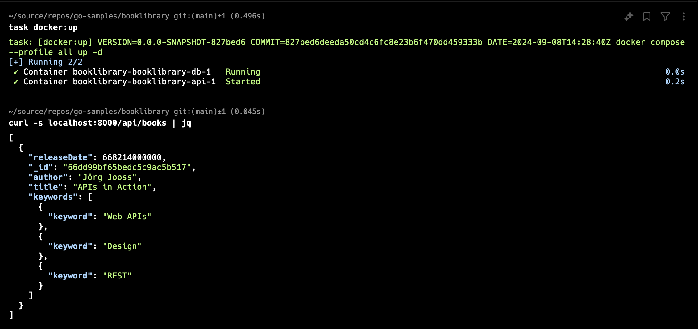

# booklibrary

## About
This is a [Go](https://golang.org/) port of [Addy Osmani's Book Library sample for
Backbone.js and Node.js](https://addyosmani.com/backbone-fundamentals/#exercise-2-book-library---your-first-restful-backbone.js-app). It uses [slog](https://pkg.go.dev/log/slog) and exposes a Prometheus endpoint to scrape metrics. It supports both MongoDB and [DocumentDB](https://documentdb.io/).

> Note: This project only contains the Web API, but not the original Backbone SPA or any other client application.

## Useful commands
This project uses [Task](https://taskfile.dev/) for building and testing the app. The application binds to 0.0.0.0:8000 and the API is  exposed under at /api/books.

To test the API, you can use any suitable HTTP client such as Postman, curl, wget, httpie etc.

```bash
curl -s localhost:8000/api/books | jq
```




### Tidy, run tests, and build
```bash
task 
# alternatively
task default
```

### Build binary
```bash
task go:build
```

### Format source code and clean up go.mod
```
task go:tidy
```

### Run app (implicitly builds the app and discards the binary after execution)
```bash
task go:run
```

### Run tests
```
task go:test
```

### Build app container image
```
task docker:build
```

### Run app and MongoDB containers
```bash
task docker:up
```

### Shut down app and MongoDB containers
```
task docker:down
```

### Run MongoDB container for development
```bash
task mongo:up
```

### Run mongosh in container
```bash
task mongo:sh
```

### Shut down MongoDB container
```bash
task mongo:down
```

### Run DocumentDB Local container for development
```bash
task docdb:up
```

### Shut down MongoDB container
```bash
task docdb:down
```

### Overriding default settings for containers
The tasks listed above use Docker Compose to control container execution. You can override a few settings used by the Compose file. Either create an [`.env` file](https://docs.docker.com/compose/environment-variables/) or export them in your shell.


| Variable     | Purpose                                                               | Default Value |
|--------------|-----------------------------------------------------------------------|---------------|
| `DOCKERFILE` | Dockerfile used for building the container image                      | `Dockerfile`  |
| `TAG`        | Image tag used for the locally built container image                  | `latest`      |
| `MONGO_TAG`  | MongoDB image tag (DocumentDB Local is currentl hard-coded to latest) | `8.2-ubi9`    |
